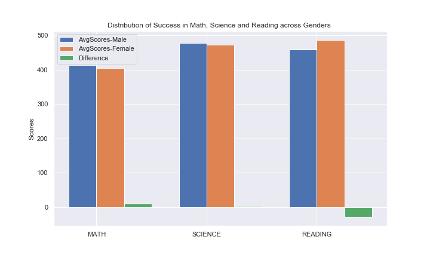
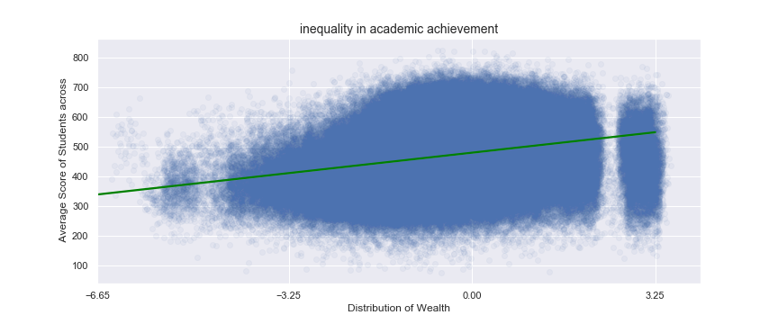
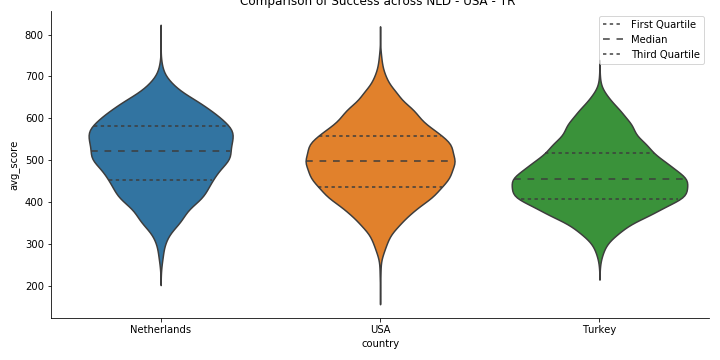

# Project: Analyse PISA Data

## Introduction

In this Data Vizualization Project we're going to Explore and Explain [**PISA Data**](https://www.oecd.org/pisa/data/pisa2012database-downloadabledata.htm)

PISA is a survey of students' skills and knowledge as they approach the end of compulsory education. It is not a conventional school test. Rather than examining how well students have learned the school curriculum, it looks at how well prepared they are for life beyond school.

Around 510,000 students in 65 economies took part in the PISA 2012 assessment of reading, mathematics and science representing about 28 million 15-year-olds globally. Of those economies, 44 took part in an assessment of creative problem solving and 18 in an assessment of financial literacy.

There are a total of 485490 entries with in dataset and 635 different features (columns ) all explained in dictionary.

Our original dataset is massive so we need to build a cleaner one. From now on, we'll work from backwards and start from questions to filter most relevant data for our analysis.

## Explanatory Data Analysis:

Some of findings include below highlights; and there're more details and reports which are included in the main code.

- **Distribution of Success in Math, Science and Reading across Genders**

Data suggests that Male students are better at Math and Science compared to their Female classmates whereas Femalse students are much better at Reading.

- **Does there exist inequality in academic achievement? For which we'll examine difference in wealth.**

Despite overplotting caused by too many data points, regression line is also proving that there's a positive correlation between wealth and academic achievement.

- **Compare Success between Netherlands, USA and Turkey**

This one suggests in terms of avg_scores Netherlands comes first whereas Turk
ey is the last

So some of the descriptive features in our clear dataframe are :

- **Descriptive Feature1 :** Achievements ( math,science,reading and average )

- **Descriptive Feature2 :** Countries

- **Descriptive Feature3 :** Gender

- **Descriptive Feature4 :** Wealth

- **Descriptive Feature5 :** Teacher Student Relations(then we ignored this due to high amount of NaN values )

## Conclusions

Below comes full list of questions and outcomes; details of which are included in code and presentation :

- **Question1 :** Distribution of Data Across Countries ?

Most of the students are from coming from Mexico(7% of overall), Italy(6.4% of overall) and Spain (5.2% of overall) respectively.
On the other hand Iceland(0.7% of overall), Russia(0.4% of overall) and Liechtenstein (0.1% of overall) are the countries with least amount of participation.

- **Question2 :** Distribution of Data Across Gender ?  

Data has been spreaded across genders almost evenly; 50.6% of overall participants are Female whereas remaining are 49.4% are Male

- **Question3 :** Distribution of Success in Math, Science and Reading ?

For all subjects, most frequest score achieved is between range 400 and 500.Most number of highest scores (between range 700-800 for all subjects) seem to be from Math category whereas we observe the least scores on Reading category (between range 100-200 )

- **Question4 :** Distribution of Success in Math, Science and Reading across Genders

Data suggests that Male students are better at Math and Science compared to their Female classmates whereas Femalse students are much better at Reading.

- **Question5 :** Does there exist inequality in academic achievement? For which we'll examine difference in wealth.

Although it was expected, there's a sharp increase in scores as the wealth goes up. Vast majority of students belong to "medium" category in terms of wealth. Despite overplotting caused by too many data points, regression line is also proving that there's a positive correlation between wealth and academic achievement.

- **Question6 :**  Distribution of Success in Math, Science and Reading across Countries

We can easily compare average success in math, science and reading across all countries. In our detailed analysis for Netherlands, USA and Turkey; data suggests that in all of those categories students from Netherlands have the highest average whereas the ones from Turkey has the least.

## List of resources used

- [encoding-error-in-panda-read-csv](https://stackoverflow.com/questions/30462807/encoding-error-in-panda-read-csv)

- [low-memory-and-dtype-options](https://stackoverflow.com/questions/24251219/pandas-read-csv-low-memory-and-dtype-options)

- [settingwithcopywarning-in-pandas](https://stackoverflow.com/questions/20625582/how-to-deal-with-settingwithcopywarning-in-pandas)

- [pd.cut](https://stackoverflow.com/questions/49382207/how-to-map-numeric-data-into-categories-bins-in-pandas-dataframe)

- [seaborn.countplot.html](https://seaborn.pydata.org/generated/seaborn.countplot.html)

- [bar-charts-in-matplotlib/](https://benalexkeen.com/bar-charts-in-matplotlib/)

- [seaborn.violinplot.html](https://seaborn.pydata.org/generated/seaborn.violinplot.html)

- [restriction-on-catplot-with-subplot](https://stackoverflow.com/questions/56788245/is-there-a-restriction-on-catplot-with-subplot)

- [hide-the-input-cells-from-your-ipython-slides](http://damianavila.github.io/blog/posts/hide-the-input-cells-from-your-ipython-slides.html)
